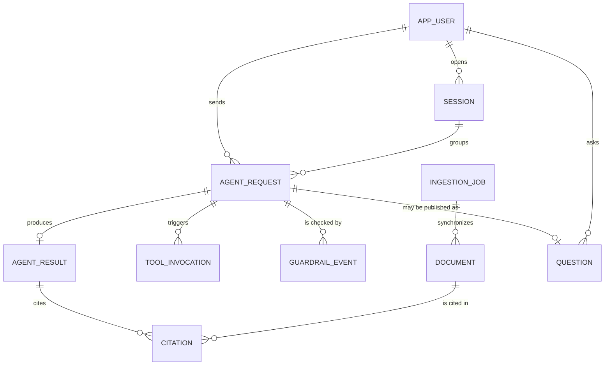

# Entity Model

> Derivado de `docs/requirements.md` (FR-002, FR-010 a FR-020, NFR-007, NFR-009, NFR-010). Cubre el dominio de "Pregúntale al repo": usuarios con perfil y rol, documentos con nivel de acceso, conversaciones, invocaciones del agente y eventos de guardrails. Los usuarios y credenciales viven en Cognito; `APP_USER` guarda solo lo que el agente necesita conocer. Las entidades `QUESTION` y `INGESTION_JOB` cubren FR-020 (opcional) y FR-014.

## Entity Relationship Diagram

### APP_USER

Person who uses the agent. Identity comes from the Cognito JWT; this entity keeps the profile and role that drive answer style and document access.

| Attribute   | Description                                          | Data Type | Length/Precision | Validation Rules                                       |
|-------------|------------------------------------------------------|-----------|------------------|--------------------------------------------------------|
| id          | Unique identifier                                    | Long      | 19               | Primary Key, Sequence                                  |
| cognito_sub | Subject claim of the Cognito token                   | String    | 36               | Not Null, Unique                                       |
| email       | Email used to sign in                                | String    | 254              | Not Null, Unique, Valid email format                   |
| profile     | Audience type that shapes how the agent answers      | String    | 20               | Not Null, Values: Student, Professional, General       |
| role        | What the user is allowed to see and do               | String    | 20               | Not Null, Values: Attendee, Presenter                  |
| created_at  | Moment the user first reached the agent              | DateTime  | -                | Not Null                                               |

**Constraints:** profile and role are read from the token on every request; the stored values are a snapshot for traceability. Only users with role Presenter may access documents with access level Presenter and the questions summary.

### SESSION

One conversation of a user with the agent. Its identifier is the session of AgentCore Memory (short-term), so follow-up questions keep their context.

| Attribute  | Description                                        | Data Type | Length/Precision | Validation Rules                                  |
|------------|----------------------------------------------------|-----------|------------------|---------------------------------------------------|
| id         | Unique identifier                                  | Long      | 19               | Primary Key, Sequence                             |
| session_id | Identifier of the AgentCore Memory session         | String    | 36               | Not Null, Unique                                  |
| app_user_id | User who owns the conversation                    | Long      | 19               | Not Null, Foreign Key (APP_USER.id)               |
| started_at | Moment the conversation began                      | DateTime  | -                | Not Null                                          |
| last_activity_at | Moment of the latest request in the session  | DateTime  | -                | Not Null                                          |

**Constraints:** last_activity_at must not be before started_at. A session belongs to exactly one user; a user cannot read the memory of another user's session.

### AGENT_REQUEST

Represents one invocation of the agent received through the API, either answered synchronously or queued for asynchronous processing.

| Attribute    | Description                                              | Data Type | Length/Precision | Validation Rules                                       |
|--------------|----------------------------------------------------------|-----------|------------------|--------------------------------------------------------|
| id           | Unique identifier                                        | Long      | 19               | Primary Key, Sequence                                  |
| request_id   | Correlation ID used to trace the request in CloudWatch   | String    | 36               | Not Null, Unique                                       |
| app_user_id  | User who sent the request                                | Long      | 19               | Not Null, Foreign Key (APP_USER.id)                    |
| session_id   | Conversation the request belongs to                      | Long      | 19               | Not Null, Foreign Key (SESSION.id)                     |
| prompt       | Text sent by the caller to the agent                     | String    | 500              | Not Null                                               |
| profile_applied | Profile used to shape the answer                      | String    | 20               | Not Null, Values: Student, Professional, General       |
| mode         | Whether the request is answered directly or through SQS  | String    | 20               | Not Null, Values: Sync, Async                          |
| status       | Current state of the request                             | String    | 20               | Not Null, Values: Received, Queued, Processing, Completed, Blocked, Failed |
| created_at   | Moment the API received the request                      | DateTime  | -                | Not Null                                               |
| completed_at | Moment the request reached Completed, Blocked or Failed  | DateTime  | -                | Optional                                               |

**Constraints:** completed_at must be after created_at. Requests with mode Async pass through the Queued status; requests with mode Sync do not. A request in status Blocked has at least one GUARDRAIL_EVENT with action Blocked. profile_applied equals the profile in the user's token at the moment of the request.

### AGENT_RESULT

Stores the outcome of an agent request, either the response text or the error that stopped it.

| Attribute        | Description                                   | Data Type | Length/Precision | Validation Rules                   |
|------------------|-----------------------------------------------|-----------|------------------|------------------------------------|
| id               | Unique identifier                             | Long      | 19               | Primary Key, Sequence              |
| agent_request_id | Request this result belongs to                | Long      | 19               | Not Null, Foreign Key (AGENT_REQUEST.id) |
| response_text    | Answer produced by the agent                  | String    | 2000             | Optional                           |
| error_message    | Reason the request failed or was blocked      | String    | 500              | Optional                           |
| duration_ms      | Time the agent took to produce the outcome    | Integer   | 10               | Not Null, Min: 0, Max: 900000      |
| created_at       | Moment the result was stored                  | DateTime  | -                | Not Null                           |

**Constraints:** Exactly one of response_text or error_message must be filled. A request has at most one result. A result with response_text has at least one CITATION, unless the answer states that no source was found.

### DOCUMENT

A repository document loaded into the knowledge base, with the access level that decides who may receive its content.

| Attribute      | Description                                          | Data Type | Length/Precision | Validation Rules                              |
|----------------|------------------------------------------------------|-----------|------------------|-----------------------------------------------|
| id             | Unique identifier                                    | Long      | 19               | Primary Key, Sequence                         |
| source_path    | Path of the file in the repository                   | String    | 255              | Not Null, Unique                              |
| title          | Human-readable title                                 | String    | 200              | Not Null                                      |
| access_level   | Minimum role allowed to receive the content          | String    | 20               | Not Null, Values: Public, Presenter           |
| checksum       | SHA-256 of the file content, used to detect changes  | String    | 64               | Not Null                                      |
| sync_status    | State of the document in the knowledge base          | String    | 20               | Not Null, Values: Pending, Synced, Failed     |
| ingestion_job_id | Latest job that synchronized the document          | Long      | 19               | Optional, Foreign Key (INGESTION_JOB.id)      |
| synced_at      | Moment the document was last synchronized            | DateTime  | -                | Optional                                      |

**Constraints:** synced_at is required when sync_status is Synced. A document only changes access_level through a new synchronization. The knowledge base metadata carries the same access_level, so retrieval can filter by role.

### INGESTION_JOB

One synchronization run that loads changed documents into the knowledge base (FR-014).

| Attribute          | Description                                     | Data Type | Length/Precision | Validation Rules                                       |
|--------------------|-------------------------------------------------|-----------|------------------|--------------------------------------------------------|
| id                 | Unique identifier                               | Long      | 19               | Primary Key, Sequence                                  |
| job_id             | Ingestion job identifier returned by Bedrock    | String    | 36               | Not Null, Unique                                       |
| status             | State of the run                                | String    | 20               | Not Null, Values: Started, InProgress, Complete, Failed |
| documents_scanned  | Documents examined in the run                   | Integer   | 10               | Not Null, Min: 0                                       |
| documents_failed   | Documents that could not be ingested            | Integer   | 10               | Not Null, Min: 0                                       |
| started_at         | Moment the run began                            | DateTime  | -                | Not Null                                               |
| finished_at        | Moment the run ended                            | DateTime  | -                | Optional                                               |

**Constraints:** documents_failed must not exceed documents_scanned. finished_at is required when status is Complete or Failed and must be after started_at.

### CITATION

Link between an agent result and a document that supported the answer.

| Attribute        | Description                                        | Data Type | Length/Precision | Validation Rules                           |
|------------------|----------------------------------------------------|-----------|------------------|--------------------------------------------|
| id               | Unique identifier                                  | Long      | 19               | Primary Key, Sequence                      |
| agent_result_id  | Result that cites the document                     | Long      | 19               | Not Null, Foreign Key (AGENT_RESULT.id)    |
| document_id      | Document used as source                            | Long      | 19               | Not Null, Foreign Key (DOCUMENT.id)        |
| excerpt          | Fragment of the document that supported the answer | String    | 500              | Not Null                                   |
| relevance_score  | Similarity score returned by the knowledge base    | Decimal   | 5,4              | Not Null, Min: 0, Max: 1                   |

**Constraints:** the access_level of the cited document must not exceed the role of the user who sent the request (NFR-009). A result cites a given document at most once.

### GUARDRAIL_EVENT

Records what Bedrock Guardrails did with the input or the output of a request (FR-019, NFR-010).

| Attribute        | Description                                       | Data Type | Length/Precision | Validation Rules                                              |
|------------------|---------------------------------------------------|-----------|------------------|---------------------------------------------------------------|
| id               | Unique identifier                                 | Long      | 19               | Primary Key, Sequence                                         |
| agent_request_id | Request that was checked                          | Long      | 19               | Not Null, Foreign Key (AGENT_REQUEST.id)                      |
| direction        | Which side of the exchange was checked            | String    | 20               | Not Null, Values: Input, Output                               |
| action           | What the guardrail did                            | String    | 20               | Not Null, Values: Passed, Blocked, Anonymized                 |
| category         | Kind of rule that acted                           | String    | 30               | Optional, Values: DeniedTopic, PromptAttack, PersonalData, Content |
| occurred_at      | Moment the check happened                         | DateTime  | -                | Not Null                                                      |

**Constraints:** category is required when action is Blocked or Anonymized. Every request has at least one GUARDRAIL_EVENT with direction Input.

### QUESTION

Question published to the live question box during the talk (optional, FR-020). It reuses the agent request that answered it.

| Attribute        | Description                                       | Data Type | Length/Precision | Validation Rules                                |
|------------------|---------------------------------------------------|-----------|------------------|-------------------------------------------------|
| id               | Unique identifier                                 | Long      | 19               | Primary Key, Sequence                           |
| app_user_id      | User who asked                                    | Long      | 19               | Not Null, Foreign Key (APP_USER.id)             |
| agent_request_id | Request that processed the question               | Long      | 19               | Optional, Foreign Key (AGENT_REQUEST.id)        |
| text             | Question as the audience wrote it                 | String    | 500              | Not Null                                        |
| status           | State of the question in the queue                | String    | 20               | Not Null, Values: Queued, Answered, Failed      |
| submitted_at     | Moment the question entered the queue             | DateTime  | -                | Not Null                                        |

**Constraints:** agent_request_id is required when status is Answered. Only users with role Presenter may list or summarize questions of other users.

### TOOL_INVOCATION

Records one tool call made by the agent while handling a request, whether the tool is a Lambda behind AgentCore Gateway or one provided by the AWS MCP server.

| Attribute        | Description                                     | Data Type | Length/Precision | Validation Rules                         |
|------------------|-------------------------------------------------|-----------|------------------|------------------------------------------|
| id               | Unique identifier                               | Long      | 19               | Primary Key, Sequence                    |
| agent_request_id | Request during which the tool was called        | Long      | 19               | Not Null, Foreign Key (AGENT_REQUEST.id) |
| tool_name        | Name of the tool invoked                        | String    | 100              | Not Null                                 |
| source           | Where the tool comes from                       | String    | 20               | Not Null, Values: Gateway, Mcp           |
| status           | Outcome of the tool call                        | String    | 20               | Not Null, Values: Succeeded, Failed      |
| duration_ms      | Time the tool call took                         | Integer   | 10               | Not Null, Min: 0, Max: 900000            |
| invoked_at       | Moment the tool call started                    | DateTime  | -                | Not Null                                 |
