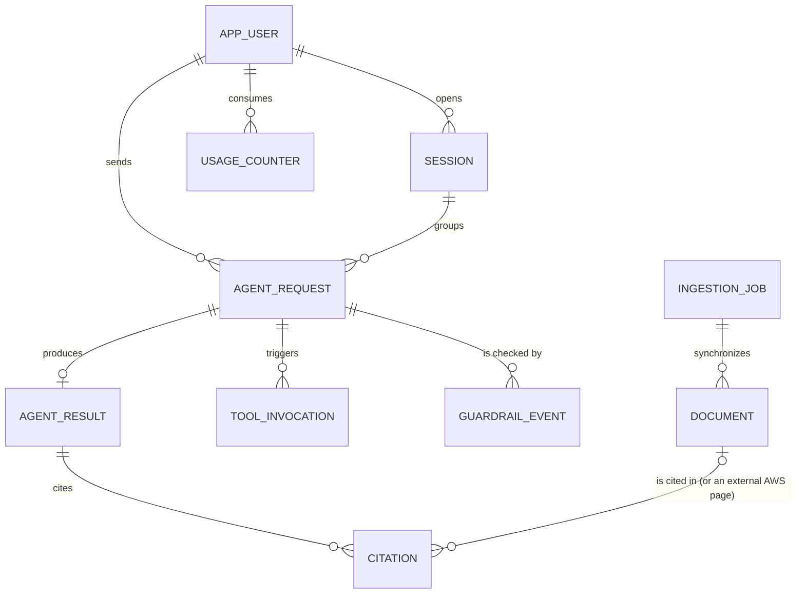

# Entity Model

> Derivado de `docs/requirements.md` (FR-002, FR-010 a FR-023, NFR-007, NFR-009, NFR-010, NFR-013). Cubre "Pregúntale al repo": usuarios con rol, conversaciones con perfil de respuesta, documentos del repositorio, invocaciones del agente y eventos de guardrails. Los usuarios y credenciales viven en Cognito. Las conversaciones y solicitudes se guardan en DynamoDB (historial, análisis del ponente y cuotas); AgentCore Memory guarda solo el contexto que el agente necesita.

## Entity Relationship Diagram

### APP_USER

Person who uses the agent. Identity comes from the Cognito JWT; this entity keeps the role and the data needed for quotas and history.

| Attribute   | Description                                          | Data Type | Length/Precision | Validation Rules                                       |
|-------------|------------------------------------------------------|-----------|------------------|--------------------------------------------------------|
| id          | Unique identifier                                    | Long      | 19               | Primary Key, Sequence                                  |
| cognito_sub | Subject claim of the Cognito token                   | String    | 36               | Not Null, Unique                                       |
| email       | Email used to sign in                                | String    | 254              | Not Null, Unique, Valid email format                   |
| role        | What the user is allowed to do                       | String    | 20               | Not Null, Values: Participant, Speaker                 |
| created_at  | Moment the user first reached the agent              | DateTime  | -                | Not Null                                               |

**Constraints:** the role is read from the Cognito group in the token on every request; the stored value is a snapshot. Only users with role Speaker may run the speaker tools (top 10 of questions). A user can only read their own sessions, requests and results.

### SESSION

One conversation of a user with the agent. Its identifier is the session of AgentCore Memory (short-term), so follow-up questions keep their context. The user picks the profile (Basic for students, Technical for professionals, General for the public) and may change it at any time.

| Attribute  | Description                                        | Data Type | Length/Precision | Validation Rules                                  |
|------------|----------------------------------------------------|-----------|------------------|---------------------------------------------------|
| id         | Unique identifier                                  | Long      | 19               | Primary Key, Sequence                             |
| session_id | Identifier of the AgentCore Memory session         | String    | 36               | Not Null, Unique                                  |
| app_user_id | User who owns the conversation                    | Long      | 19               | Not Null, Foreign Key (APP_USER.id)               |
| profile    | Answer style chosen by the user for this session   | String    | 20               | Not Null, Values: Basic, Technical, General       |
| started_at | Moment the conversation began                      | DateTime  | -                | Not Null                                          |
| last_activity_at | Moment of the latest request in the session  | DateTime  | -                | Not Null                                          |

**Constraints:** last_activity_at must not be before started_at. A session belongs to exactly one user; a user cannot read the memory of another user's session. Changing the profile applies from the next request.

### AGENT_REQUEST

Represents one invocation of the agent received through the API. Every request goes through SQS and is orchestrated by a Lambda that calls the agent and formats the answer.

| Attribute    | Description                                              | Data Type | Length/Precision | Validation Rules                                       |
|--------------|----------------------------------------------------------|-----------|------------------|--------------------------------------------------------|
| id           | Unique identifier                                        | Long      | 19               | Primary Key, Sequence                                  |
| request_id   | Correlation ID used to trace the request in CloudWatch   | String    | 36               | Not Null, Unique                                       |
| app_user_id  | User who sent the request                                | Long      | 19               | Not Null, Foreign Key (APP_USER.id)                    |
| session_id   | Conversation the request belongs to                      | Long      | 19               | Not Null, Foreign Key (SESSION.id)                     |
| prompt       | Text sent to the agent, stored with emails and phone numbers already masked| String    | 500              | Not Null                                               |
| profile_applied | Profile used to shape the answer                      | String    | 20               | Not Null, Values: Basic, Technical, General            |
| status       | Current state of the request                             | String    | 20               | Not Null, Values: Received, Queued, Processing, Completed, Blocked, Failed, Rejected |
| notices      | Notices shown to the participant about how the request was handled | String (list) | 200 | Optional, Values per item: personal_data_masked, memory_unavailable |
| created_at   | Moment the API received the request                      | DateTime  | -                | Not Null                                               |
| completed_at | Moment the request reached Completed, Blocked or Failed  | DateTime  | -                | Optional                                               |

**Constraints:** completed_at must be after created_at. Every request passes through the Queued status. A request in status Blocked has at least one GUARDRAIL_EVENT with action Blocked. A request in status Rejected exceeded a usage limit and never reached the model. profile_applied equals the profile of the session at the moment of the request.

### AGENT_RESULT

Stores the outcome of an agent request, either the response text or the error that stopped it.

| Attribute        | Description                                   | Data Type | Length/Precision | Validation Rules                   |
|------------------|-----------------------------------------------|-----------|------------------|------------------------------------|
| id               | Unique identifier                             | Long      | 19               | Primary Key, Sequence              |
| agent_request_id | Request this result belongs to                | Long      | 19               | Not Null, Foreign Key (AGENT_REQUEST.id) |
| response_text    | Answer produced by the agent, formatted as Markdown | String | 2000        | Optional                           |
| no_source        | The answer says that no repository document supports the question | Boolean | - | Not Null, Default: false |
| truncated        | The answer was cut at the length limit                         | Boolean   | -                | Not Null, Default: false           |
| error_message    | Reason the request failed or was blocked      | String    | 500              | Optional                           |
| duration_ms      | Time the agent took to produce the outcome    | Integer   | 10               | Not Null, Min: 0, Max: 900000      |
| created_at       | Moment the result was stored                  | DateTime  | -                | Not Null                           |

**Constraints:** Exactly one of response_text or error_message must be filled. A request has at most one result. A result with response_text has at least one CITATION, unless the answer states that no source was found.

### DOCUMENT

A file of the GitHub repository (vision, requirements, entity model, use case and test case specs, talk notes, README) loaded into the knowledge base. Tests, helper scripts and working logs (the pre-talk checklist and the browser-test report) are not loaded (UC-003 BR-001). The whole repository is public, so every document is available to every user.

| Attribute      | Description                                          | Data Type | Length/Precision | Validation Rules                              |
|----------------|------------------------------------------------------|-----------|------------------|-----------------------------------------------|
| id             | Unique identifier                                    | Long      | 19               | Primary Key, Sequence                         |
| source_path    | Path of the file in the repository                   | String    | 255              | Not Null, Unique                              |
| title          | Human-readable title                                 | String    | 200              | Not Null                                      |
| checksum       | SHA-256 of the file content, used to detect changes  | String    | 64               | Not Null                                      |
| sync_status    | State of the document in the knowledge base          | String    | 20               | Not Null, Values: Pending, Synced, Failed     |
| ingestion_job_id | Latest job that synchronized the document          | Long      | 19               | Optional, Foreign Key (INGESTION_JOB.id)      |
| synced_at      | Moment the document was last synchronized            | DateTime  | -                | Optional                                      |

**Constraints:** synced_at is required when sync_status is Synced. source_path is the path in the repository and is used to build the link shown in citations.

### INGESTION_JOB

One synchronization run that loads changed documents into the knowledge base (FR-014).

| Attribute          | Description                                     | Data Type | Length/Precision | Validation Rules                                       |
|--------------------|-------------------------------------------------|-----------|------------------|--------------------------------------------------------|
| id                 | Unique identifier                               | Long      | 19               | Primary Key, Sequence                                  |
| job_id             | Ingestion job identifier returned by Bedrock    | String    | 36               | Not Null, Unique                                       |
| status             | State of the run                                | String    | 20               | Not Null, Values: Started, InProgress, Complete, Failed |
| documents_scanned  | Documents examined in the run                   | Integer   | 10               | Not Null, Min: 0                                       |
| documents_failed   | Documents that could not be ingested            | Integer   | 10               | Not Null, Min: 0                                       |
| started_at         | Moment the run began                            | DateTime  | -                | Not Null                                               |
| finished_at        | Moment the run ended                            | DateTime  | -                | Optional                                               |

**Constraints:** documents_failed must not exceed documents_scanned. finished_at is required when status is Complete or Failed and must be after started_at.

### CITATION

Link between an agent result and a document that supported the answer.

| Attribute        | Description                                        | Data Type | Length/Precision | Validation Rules                           |
|------------------|----------------------------------------------------|-----------|------------------|--------------------------------------------|
| id               | Unique identifier                                  | Long      | 19               | Primary Key, Sequence                      |
| agent_result_id  | Result that cites the document                     | Long      | 19               | Not Null, Foreign Key (AGENT_RESULT.id)    |
| document_id      | Repository document used as source (empty for an external source) | Long | 19 | Optional, Foreign Key (DOCUMENT.id) |
| external_title   | Title of an external page of the official AWS documentation | String    | 200              | Optional                                   |
| external_url     | Link to that external page (only https to aws.amazon.com and subdomains) | String | 500 | Optional, Format: https URL                |
| excerpt          | Fragment of the document that supported the answer | String    | 500              | Not Null                                   |
| relevance_score  | Similarity score returned by the knowledge base    | Decimal   | 5,4              | Not Null, Min: 0, Max: 1                   |

**Constraints:** a result cites a given document at most once. Exactly one of document_id or external_url is filled. The link for a repository document is built from its source_path. External sources exist only in answers to the Ponente that used the AWS documentation tool (see TOOL_INVOCATION, source Mcp).

### GUARDRAIL_EVENT

Records what Bedrock Guardrails did with the input or the output of a request (FR-019, NFR-010).

| Attribute        | Description                                       | Data Type | Length/Precision | Validation Rules                                              |
|------------------|---------------------------------------------------|-----------|------------------|---------------------------------------------------------------|
| id               | Unique identifier                                 | Long      | 19               | Primary Key, Sequence                                         |
| agent_request_id | Request that was checked                          | Long      | 19               | Not Null, Foreign Key (AGENT_REQUEST.id)                      |
| direction        | Which side of the exchange was checked            | String    | 20               | Not Null, Values: Input, Output                               |
| action           | What the guardrail did                            | String    | 20               | Not Null, Values: Passed, Blocked, Anonymized                 |
| category         | Kind of rule that acted                           | String    | 30               | Optional, Values: DeniedTopic, PromptAttack, PersonalData, Content |
| occurred_at      | Moment the check happened                         | DateTime  | -                | Not Null                                                      |

**Constraints:** category is required when action is Blocked or Anonymized. Every request has at least one GUARDRAIL_EVENT with direction Input.

### USAGE_COUNTER

Number of requests a user has made on a given day, used to enforce the per-user quota and the global cap (NFR-013).

| Attribute    | Description                                    | Data Type | Length/Precision | Validation Rules                                 |
|--------------|------------------------------------------------|-----------|------------------|--------------------------------------------------|
| id           | Unique identifier                              | Long      | 19               | Primary Key, Sequence                            |
| app_user_id  | User whose usage is counted                    | Long      | 19               | Not Null, Foreign Key (APP_USER.id)              |
| usage_date   | Day the requests were made (UTC)               | Date      | -                | Not Null                                         |
| request_count | Requests accepted that day                    | Integer   | 10               | Not Null, Min: 0, Max: 100                       |

**Constraints:** one counter per user and day. When request_count reaches the daily allowance of the role (25 for a Participant, 100 for a Speaker), further requests that day are Rejected. The sum of all counters must not exceed 3000 for the project.

### TOOL_INVOCATION

Records one tool call made by the agent while handling a request, whether the tool is a Lambda behind AgentCore Gateway (for example `buscar_documentos` or the speaker-only `top_preguntas`) or one provided by the AWS MCP server.

| Attribute        | Description                                     | Data Type | Length/Precision | Validation Rules                         |
|------------------|-------------------------------------------------|-----------|------------------|------------------------------------------|
| id               | Unique identifier                               | Long      | 19               | Primary Key, Sequence                    |
| agent_request_id | Request during which the tool was called        | Long      | 19               | Not Null, Foreign Key (AGENT_REQUEST.id) |
| tool_name        | Name of the tool invoked                        | String    | 100              | Not Null                                 |
| source           | Where the tool comes from                       | String    | 20               | Not Null, Values: Gateway, Mcp           |
| status           | Outcome of the tool call                        | String    | 20               | Not Null, Values: Succeeded, Failed      |
| duration_ms      | Time the tool call took                         | Integer   | 10               | Not Null, Min: 0, Max: 900000            |
| invoked_at       | Moment the tool call started                    | DateTime  | -                | Not Null                                 |
