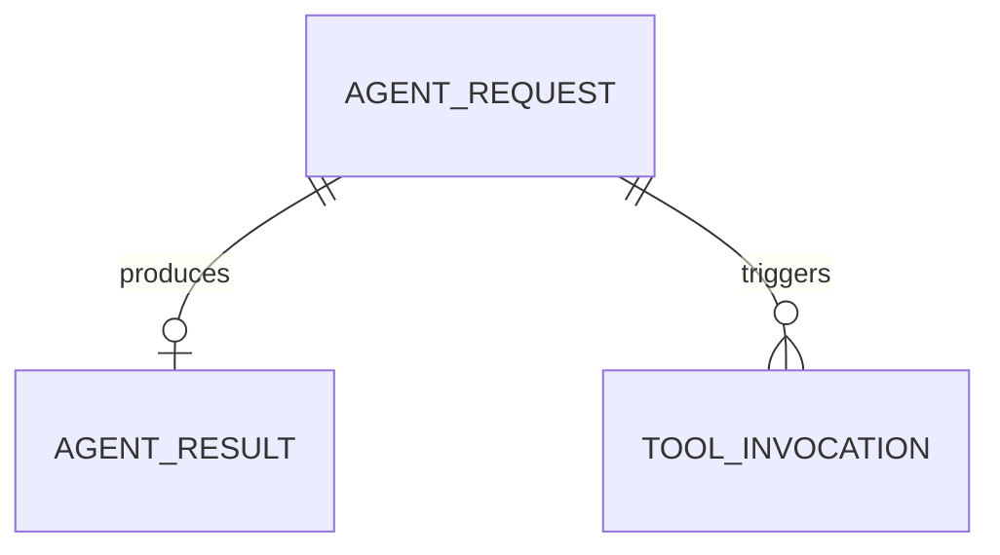

# Entity Model

> Borrador derivado de `docs/requirements.md` (FR-002, FR-010, FR-011, FR-012, NFR-007). El dominio de negocio del agente aún está por confirmar, por lo que el modelo cubre solo el ciclo de invocación del agente; se ampliará cuando se defina el dominio.

## Entity Relationship Diagram

### AGENT_REQUEST

Represents one invocation of the agent received through the API, either answered synchronously or queued for asynchronous processing.

| Attribute    | Description                                              | Data Type | Length/Precision | Validation Rules                                       |
|--------------|----------------------------------------------------------|-----------|------------------|--------------------------------------------------------|
| id           | Unique identifier                                        | Long      | 19               | Primary Key, Sequence                                  |
| request_id   | Correlation ID used to trace the request in CloudWatch   | String    | 36               | Not Null, Unique                                       |
| prompt       | Text sent by the caller to the agent                     | String    | 500              | Not Null                                               |
| mode         | Whether the request is answered directly or through SQS  | String    | 20               | Not Null, Values: Sync, Async                          |
| status       | Current state of the request                             | String    | 20               | Not Null, Values: Received, Queued, Processing, Completed, Failed |
| created_at   | Moment the API received the request                      | DateTime  | -                | Not Null                                               |
| completed_at | Moment the request reached Completed or Failed           | DateTime  | -                | Optional                                               |

**Constraints:** completed_at must be after created_at. Requests with mode Async pass through the Queued status; requests with mode Sync do not.

### AGENT_RESULT

Stores the outcome of an agent request, either the response text or the error that stopped it.

| Attribute        | Description                                   | Data Type | Length/Precision | Validation Rules                   |
|------------------|-----------------------------------------------|-----------|------------------|------------------------------------|
| id               | Unique identifier                             | Long      | 19               | Primary Key, Sequence              |
| agent_request_id | Request this result belongs to                | Long      | 19               | Not Null, Foreign Key (AGENT_REQUEST.id) |
| response_text    | Answer produced by the agent                  | String    | 500              | Optional                           |
| error_message    | Reason the request failed                     | String    | 500              | Optional                           |
| duration_ms      | Time the agent took to produce the outcome    | Integer   | 10               | Not Null, Min: 0, Max: 900000      |
| created_at       | Moment the result was stored                  | DateTime  | -                | Not Null                           |

**Constraints:** Exactly one of response_text or error_message must be filled. A request has at most one result.

### TOOL_INVOCATION

Records one tool call made by the agent while handling a request, whether the tool is local or provided by the AWS MCP server.

| Attribute        | Description                                     | Data Type | Length/Precision | Validation Rules                         |
|------------------|-------------------------------------------------|-----------|------------------|------------------------------------------|
| id               | Unique identifier                               | Long      | 19               | Primary Key, Sequence                    |
| agent_request_id | Request during which the tool was called        | Long      | 19               | Not Null, Foreign Key (AGENT_REQUEST.id) |
| tool_name        | Name of the tool invoked                        | String    | 100              | Not Null                                 |
| source           | Where the tool comes from                       | String    | 20               | Not Null, Values: Local, Mcp             |
| status           | Outcome of the tool call                        | String    | 20               | Not Null, Values: Succeeded, Failed      |
| duration_ms      | Time the tool call took                         | Integer   | 10               | Not Null, Min: 0, Max: 900000            |
| invoked_at       | Moment the tool call started                    | DateTime  | -                | Not Null                                 |
